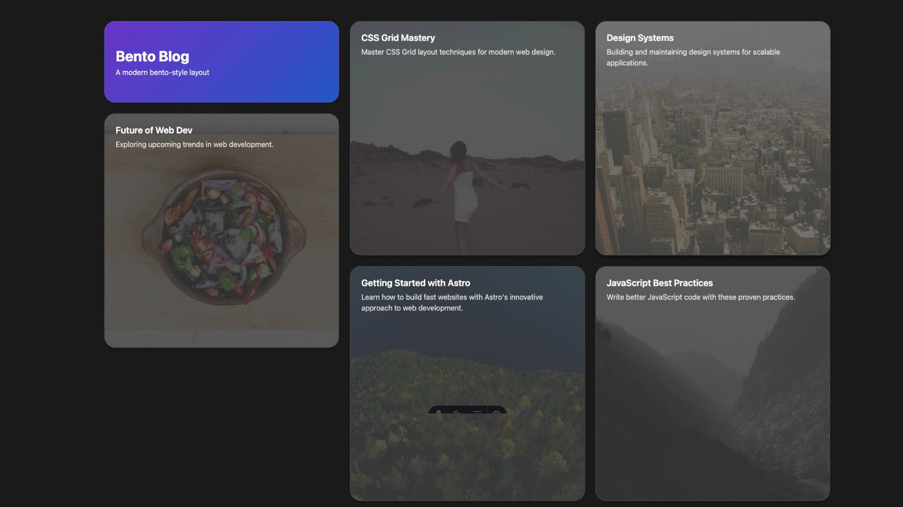

# Bento Style for Astro

DEMO
[bento.temaprint.com](https://bento.temaprint.com/)

A modern and aesthetic design template inspired by the Bento UI style. Built with Astro and optimized for performance and visual appeal.




## Features

- Clean and organized Bento-style layout
- Fast and efficient performance
- Dynamic content blocks for better structure
- Modular design for easy customization
- Responsive and mobile-friendly
- Supports Astro Image Tools for optimized images

## Getting Started

```bash
npm install
npm run dev
npm run build  
npm run preview
```

## Content Structure

- `/src/content/blocks/` - Bento-style content blocks
- `/src/content/pages/` - Static pages
- `/public/images/` - Image assets

## Customization

- Modify the content inside `/src/content/` for text and media updates
- Adjust the layout and styles via `/src/layouts/` for the Bento-style structure
- Use Astro Image Tools for optimized images to improve performance

## License

This project is licensed under the MIT License - see the LICENSE file for details.

